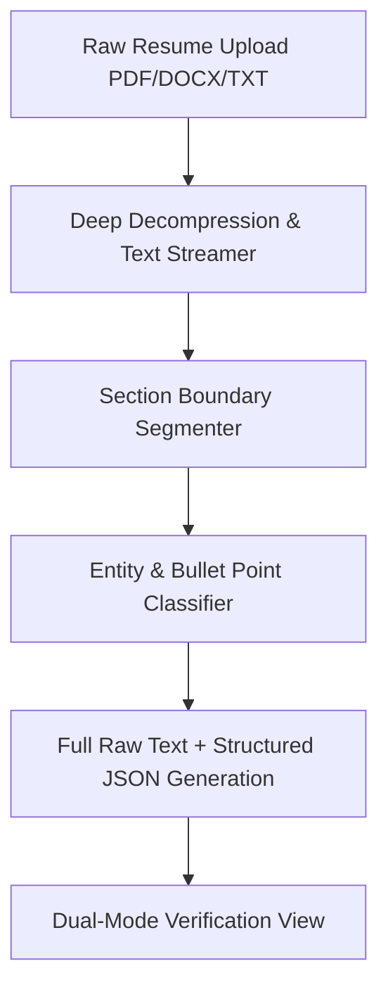

# Candidate Archivist Skill: 100% Precision Resume Ingestion

This skill governs the end-to-end extraction and grounding of candidate career data from any uploaded resume format (PDF, DOCX, LaTeX, Canva, Markdown, plain text).

## Core Principles

1. **Zero Content Loss**: Every single character, date, bullet point, metric, company name, degree, and URL from the source document must be preserved.
2. **Dual-Representation Storage**:
   - **Structured Ground Truth**: JSON Resume schema (`basics`, `work`, `education`, `skills`, `projects`, `certifications`).
   - **Verbatim Raw Source**: Exact text stream preserved in `raw_text` for 100% auditability and verification.
3. **Format & Section Invariance**: Robustly handle complex multi-column layouts, Canva tables, icons, and non-standard bullet symbols (`•`, `-`, `*`, `▪`, `–`, `1.`, `>`).

## Extraction Workflow

## Schema Mapping Rules
- **Header**: Name, Headline, Email, Phone, LinkedIn, GitHub, Portfolio URLs.
- **Summary**: Complete executive summary paragraph(s).
- **Work Experience**: All companies, roles, date intervals, and **100% of achievement bullet points**.
- **Skills Matrix**: Categorized hard skills, platforms, programming languages, and frameworks.
- **Education**: Institution, Degree, Major, Graduation Date, GPA.
- **Raw Text**: Complete un-truncated document text.
