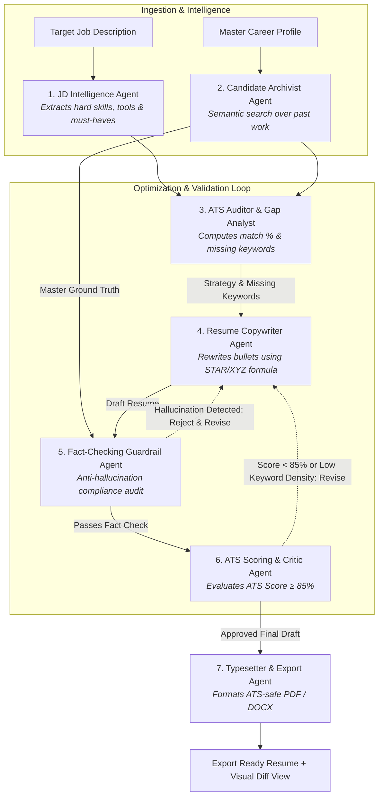

# ResumeTailor AI 🎯
> **Intelligent Job Description Analyzer & Auto-Resume Tailor** powered by a collaborative 7-agent architecture with strict anti-hallucination guardrails and ATS $\ge 85\%$ compliance.

---

## 🌟 Overview
Modern job applications are filtered through Applicant Tracking Systems (ATS) and strict recruiter criteria. Generic resumes often get rejected due to keyword gaps, weak impact phrasing, or misaligned formatting.

**ResumeTailor AI** bridges this gap through a multi-agent AI system that:
1. **Parses & Indexes** your master career history into a structured Master Experience Bank.
2. **Deeply Analyzes** target Job Descriptions to extract technical skills, tools, domain keywords, and must-have requirements.
3. **Identifies ATS Gaps** using lexical matching and semantic vector similarity.
4. **Tailors Bullets** using the **XYZ / STAR frameworks** (*Accomplished [X], measured by [Y], by doing [Z]*).
5. **Enforces Fact-Checking Guardrails** to eliminate any synthetic hallucinations or fabricated credentials.
6. **Simulates ATS Scoring** in a cyclic reflection loop until the resume achieves $\ge 85\%$ match score.
7. **Exports** ATS-tested, single-column PDFs and editable DOCX documents with side-by-side visual diffs.

---

## 🏛️ Project Architecture

```
Resume-Automation/
├── agents/                  # Standalone Multi-Agent Framework
│   ├── orchestrator.py      # Multi-Agent StateGraph & Reflection Loop
│   ├── base.py              # Base Agent & Agent Message Interfaces
│   ├── state.py             # Agent State & Data Schemas
│   ├── workers/             # 7 Dedicated Collaborative Agents
│   │   ├── jd_intelligence.py       # 1. JD Intelligence Agent
│   │   ├── candidate_archivist.py   # 2. Candidate Archivist Agent
│   │   ├── ats_auditor.py           # 3. ATS Auditor & Gap Analyst
│   │   ├── resume_copywriter.py     # 4. Resume Copywriter (STAR/XYZ)
│   │   ├── fact_checker.py          # 5. Fact-Checking Guardrail (Anti-hallucination)
│   │   ├── ats_critic.py            # 6. ATS Critic & Score Evaluator
│   │   └── typesetter.py            # 7. Typesetter & Export Document Architect
│   ├── prompts/             # Modular prompt templates for each agent
│   ├── tools/               # Agent tools (Vector search, ATS calculation, Truth validator)
│   └── tests/               # Agent benchmark & hallucination test suite
│
├── backend/                 # FastAPI Web Server & API Layer
│   ├── app/
│   │   ├── main.py          # FastAPI application entry point
│   │   ├── core/            # Config, security, and logging
│   │   ├── api/v1/          # REST & SSE Endpoints (Onboarding, Tailoring, Diff, Export)
│   │   ├── models/          # Pydantic data models (JSON Resume, JD, ATS, Diff)
│   │   ├── parsers/         # Resume parsers (PDF, DOCX, TXT, JSON)
│   │   └── services/        # Vector search, ATS scoring, PDF/DOCX exporters
│   ├── requirements.txt
│   └── pyproject.toml
│
├── frontend/                # Next.js / React Modern Web Application
│   ├── src/
│   │   ├── app/             # App router (Onboarding, Tailor Studio, Profile Vault, Diff, Tracker)
│   │   ├── components/      # UI components (Dropzones, Diff Inspector, Score Gauges)
│   │   ├── lib/             # API client, TypeScript types, State management
│   │   └── styles/          # Global styles & Tailwind CSS
│   ├── package.json
│   └── tailwind.config.ts
│
├── data/                    # Benchmark assets & templates
│   ├── sample_resumes/      # Tech, Product, and Data Master Resumes
│   ├── sample_jds/          # Real-world target job postings
│   └── ats_templates/       # Clean single-column ATS HTML/PDF templates
│
└── docs/                    # PRD, Architecture Specs & Diagrams
    ├── PRODUCT_PLAN.md
    └── ARCHITECTURE.md
```

---

## 🤖 The 7 Collaborative AI Agents



---

## 🚀 Quickstart Guide

### 1. Repository & Automated Sync
- GitHub Repo: [https://github.com/mohdshak/resume-automation.git](https://github.com/mohdshak/resume-automation.git)
- **Automatic Push on Commit**: The repository is pre-configured with a `.git/hooks/post-commit` hook that automatically pushes to GitHub after every local commit.
- **Continuous File-Watch Auto-Sync**: To continuously monitor file changes and auto-commit/push in real-time, run:
  ```bash
  ./scripts/auto_sync.sh
  ```

### 2. Multi-Agent Engine & Backend Setup
```bash
cd backend
python3 -m venv venv
source venv/bin/activate
pip install -r requirements.txt

# Run backend API server
uvicorn app.main:app --reload --port 8000
```

### 3. Frontend Setup
```bash
cd frontend
npm install
npm run dev
```

Open [http://localhost:3000](http://localhost:3000) to access the ResumeTailor AI workspace.

