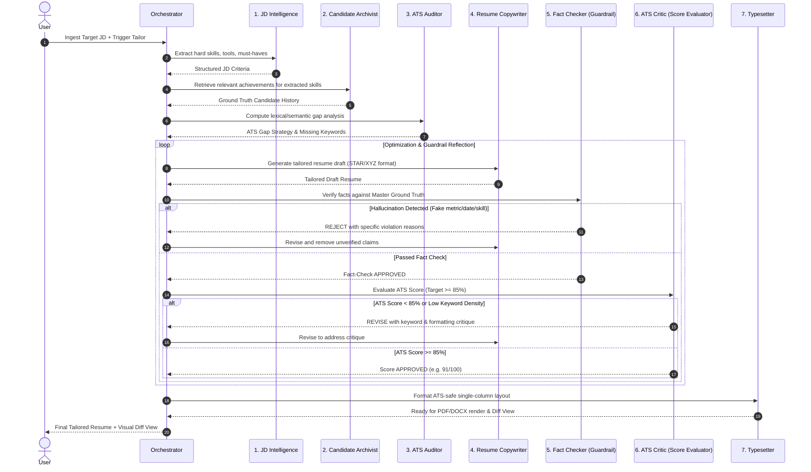

# Architecture & System Design: ResumeTailor AI

## 1. System Architecture Diagram

```mermaid
graph TD
    subgraph UI Layer ["Frontend (Next.js / Tailwind CSS)"]
        UI_FTUE[1. Guided Onboarding Modal]
        UI_WS[2. Split-screen Tailoring Studio]
        UI_DIFF[3. Side-by-Side Visual Diff Inspector]
        UI_VAULT[4. Master Profile Experience Bank]
    end

    subgraph APILayer ["Backend API Gateway (FastAPI)"]
        API_ONBOARD[/api/v1/onboarding]
        API_JD[/api/v1/jd]
        API_TAILOR[/api/v1/tailor]
        API_EXPORT[/api/v1/export]
    end

    subgraph MultiAgentEngine ["Decoupled Multi-Agent Core (agents/)"]
        ORCH[Agent Orchestrator & State Graph]
        
        A1[1. JD Intelligence Agent]
        A2[2. Candidate Archivist Agent]
        A3[3. ATS Auditor & Gap Analyst]
        A4[4. Resume Copywriter Agent]
        A5[5. Fact-Checking Guardrail Agent]
        A6[6. ATS Critic & Score Evaluator]
        A7[7. Typesetter & Export Agent]
    end

    subgraph StorageServices ["Storage & Document Engines"]
        VEC[Vector DB / Semantic Search]
        DOC_ENG[PDF/DOCX Document Parsers & Builders]
        STORE[Master Profiles & Job Log Store]
    end

    UI_FTUE --> API_ONBOARD
    UI_WS --> API_JD & API_TAILOR
    UI_DIFF --> API_TAILOR
    UI_VAULT --> API_ONBOARD

    API_ONBOARD --> A2 & DOC_ENG
    API_JD --> A1
    API_TAILOR --> ORCH

    ORCH --> A1 & A2 & A3 & A4 & A5 & A6 & A7
    A2 --> VEC & STORE
    A7 --> DOC_ENG
```

## 2. Multi-Agent Reflection & Truth Guardrail Loop



## 3. Data Flow & Schemas
- **Master Resume**: Follows the JSON Resume standard (`basics`, `work`, `education`, `skills`, `projects`, `certifications`).
- **JD Extraction**: `required_skills`, `preferred_skills`, `tools`, `experience_years`, `tone`, `responsibilities`.
- **ATS Match Score**: Weighted aggregate:
  - 40% Keyword & Tool overlap
  - 35% Semantic similarity of accomplishments to responsibilities
  - 15% STAR/XYZ metric quantification
  - 10% ATS format compliance
