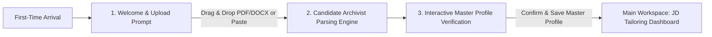
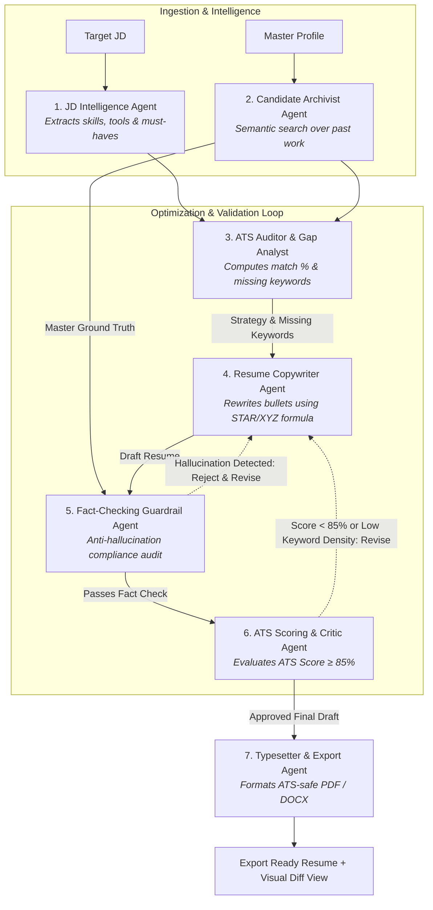

# Product Plan: AI Job Description Analyzer & Auto-Resume Tailor (ResumeTailor AI)

## Executive Summary & Product Vision
Applying to modern jobs requires tailoring resumes to match specific Applicant Tracking Systems (ATS) algorithms and hiring manager criteria. Generic resumes often get filtered out due to missing keywords, non-standard phrasing, or suboptimal alignment.

**ResumeTailor AI** is an intelligent, automated end-to-end platform powered by a **collaborative multi-agent architecture** that analyzes job descriptions, audits candidate experience, tailors content using the XYZ/STAR frameworks, rigorously verifies factual integrity, and produces ATS-compliant resumes.

---

## First-Time User Experience (FTUE) & Onboarding Flow

When a user opens the application for the very first time (or has no saved Master Resume), the app launches a **guided 3-step onboarding flow**:

### Step 1: Welcome & Master Resume Upload Modal
* **Clean, high-impact welcome screen**: Explains the core value proposition (*"Upload your current resume once. We'll turn it into your master career knowledge base and tailor it perfectly for any job posting."*).
* **Multi-channel upload options**:
  * **Drag & Drop Zone**: Supports `.pdf`, `.docx`, `.txt`, `.json` (JSON Resume format).
  * **Direct Text / Markdown Paste**: For quick pasting of existing resume text.
  * **Sample Profile Option**: *"Try with a sample Tech / Product / Marketing resume"* for instant exploration without uploading personal data.

### Step 2: Automated Parsing & Knowledge Extraction
* **Candidate Archivist Agent** extracts structured data:
  * Contact info (Name, Email, Phone, LinkedIn, GitHub, Portfolio).
  * Professional Summary.
  * Work Experience (Company, Title, Dates, Location, Quantified Bullet Points).
  * Technical Skills, Tools, and Categorized Competencies.
  * Education, Certifications, and Side Projects.

### Step 3: Interactive Master Profile Verification & Enrichment
* **Instant Profile Preview Card**: Displays parsed data in clean editable cards.
* **Master Experience Bank**: The user can review, add extra sub-bullets, unquantified achievements, or hidden skills they didn't have space for in their 1-page resume.
* **One-Click Confirmation**: Sets this as the user's permanent **Master Ground Truth** and transitions directly into the Job Tailoring workspace.

---

## Multi-Agent Architecture: How AI Agents Power the Product

### Agent Roles & Responsibilities

| Agent Name | Role & Persona | Key Responsibilities & Capabilities |
| :--- | :--- | :--- |
| **1. JD Intelligence Agent** | *Senior Technical Recruiter* | • Parses and structures raw JDs (URLs, text, PDFs). • Extracts hard technical skills, tools, domain keywords, and must-have vs. nice-to-have criteria. • Identifies company tone, culture, and primary pain points the role seeks to solve. |
| **2. Candidate Archivist Agent** | *Career Historian & Knowledge Retriever* | • Parses incoming Master Resumes during onboarding. • Manages the candidate's Master Knowledge Base (all past roles, projects, metrics, skills). • Performs vector similarity search to retrieve the most relevant past achievements for the target role. |
| **3. ATS Auditor & Gap Analyst** | *ATS Algorithm Simulator* | • Computes lexical keyword match & semantic vector overlap. • Identifies missing keywords, under-represented tools, and vocabulary mismatches. • Generates an optimization strategy blueprint for the Copywriter Agent. |
| **4. Resume Copywriter Agent** | *Executive Resume Strategist* | • Rewrites and strengthens bullet points using the **XYZ framework** (*Accomplished [X], measured by [Y], by doing [Z]*). • Adapts professional summary to speak directly to the company's needs. • Reorders skills and experience sections to emphasize top-matching capabilities. |
| **5. Fact-Checking Guardrail Agent** | *Strict Compliance Auditor* | • **Anti-Hallucination Guard**: Compares tailored draft against Master Profile ground truth. • Rejects any fabricated metrics, unverified company names, fake skills, or altered dates. • Triggers a self-correction loop if any embellishments are detected. |
| **6. ATS Critic & Score Evaluator** | *Quality Assurance Benchmark* | • Evaluates the revised resume against target ATS criteria (target score $\ge 85\%$). • If score or keyword density is insufficient, provides actionable feedback back to the Copywriter. |
| **7. Typesetter & Export Agent** | *Document Architect* | • Enforces single/two-page space budget and standard ATS section headings. • Compiles clean, machine-parseable PDF (HTML/Chromium or Typst/LaTeX) and DOCX files. |

---

## Core Product Features & Modules

### 1. Ingestion & Profile Management (Master Resume Vault)
* **Multi-Format Ingestion**: Upload PDF, DOCX, TXT, or JSON (JSONResume standard) or import from LinkedIn.
* **Master Skill Matrix**: Centralized repository of all past experiences, projects, quantified achievements, certifications, and technical proficiencies.
* **Granular Experience Bank**: Allows storing multiple variations and sub-bullets for each role so the AI can pick the most relevant accomplishments.

### 2. Job Description Analyzer & Skill Extraction Engine
* **Entity Extraction**:
  * **Hard Skills & Tools**: Python, React, AWS, Docker, PyTorch, Kubernetes, etc.
  * **Methodologies & Domain**: CI/CD, Agile/Scrum, Distributed Systems, Microservices, HIPAA compliance.
  * **Soft Skills & Leadership**: Cross-functional leadership, Mentorship, Stakeholder management.
  * **Seniority & Role Level**: Years of experience required, scope of ownership.
* **Requirement Categorization**: Strict separation of *Must-Have* vs. *Nice-to-Have* qualifications.

### 3. Match Scoring & ATS Simulation Engine
* **Hybrid Match Algorithm**:
  * **Lexical & Keyword Match (40%)**: Direct match of critical domain terms, certifications, and tools.
  * **Semantic Relevance (35%)**: Vector embeddings (cosine similarity) matching role responsibilities with past work.
  * **Impact & Structure Score (15%)**: Readability, active verbs, quantification metrics (XYZ formula).
  * **ATS Format Compliance (10%)**: Standard section headers, chronological ordering, parse-safe layouts.
* **Interactive Gap Visualizer**: Highlight missing keywords, under-emphasized skills, and terminology discrepancies.

### 4. Truth-Preserving Auto-Tailoring Engine
* **Targeted Executive Summary**: Rewrites the summary to directly address the target company's mission and job role.
* **Bullet Point Optimization (XYZ Framework)**:
  * *Accomplished [X], as measured by [Y], by doing [Z]*.
  * Synonyms and keyword alignment (e.g., matching "REST APIs" vs "Web Services").
* **Smart Skill Prioritization**: Re-orders skills to highlight the target JD's required stack first.
* **Section Relevance Pruning**: Automatically promotes highly relevant projects/roles and condenses less relevant sections to maintain a clean 1–2 page layout.

### 5. Review, Diff Inspector & Export
* **Side-by-Side Diff Viewer**: Green/red diff highlighting every modified word or bullet point with an AI rationale explaining *why* it was adapted.
* **Interactive Editor**: Live inline editing with instant ATS score recalculation.
* **ATS-Safe Multi-Format Exporter**:
  * Clean, single-column ATS-tested PDF (LaTeX / headless Chromium render).
  * Editable DOCX format.
  * JSON Resume format.
* **Job Application Pipeline Tracker**: Keeps a log of each tailored resume mapped to Company, Job Title, Application URL, Date, and Status (Applied, Interviewing, Offered, Rejected).
